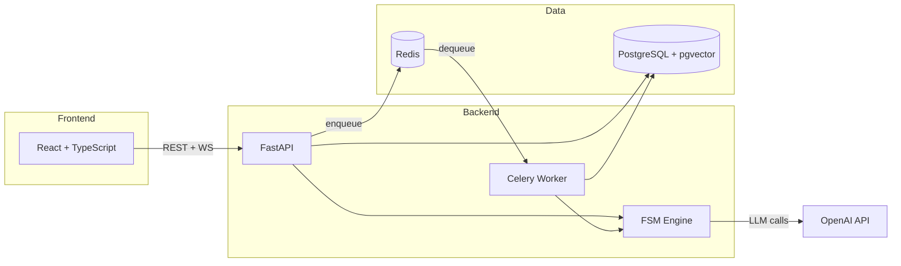

# AI Sales Agent

[](https://github.com/Umnovation/ai-sales-agent/actions/workflows/ci.yml)
[](LICENSE)
[](https://www.python.org/downloads/)
[](https://nodejs.org/)

AI-powered sales agent with a visual flow editor. Build, configure, and deploy conversational sales scripts — no code required.

Inspired by [Dialogex](https://dialogex.io) — AI-powered sales automation platform.

## Features

- **Visual Flow Editor** — Drag-and-drop script builder with React Flow
- **FSM Engine** — Finite state machine that guides conversations through configurable steps
- **Acceptance Criteria** — AI-driven script transitions based on conversation context
- **Operator Takeover** — Jump into any conversation and take control from the AI
- **RAG Integration** — Upload documents (.docx, .pdf, .txt) as knowledge base
- **Real-time Chat** — WebSocket-powered live messaging
- **Test Chat** — Test your flows directly in the editor with debug info
- **Structured Logging** — JSON logs with full conversation tracing

## Architecture



## Tech Stack

| Layer | Technology |
|-------|-----------|
| Backend | FastAPI, SQLAlchemy (async), Pydantic v2, Celery |
| Frontend | React 18, TypeScript, Tailwind CSS, shadcn/ui, React Flow |
| Database | PostgreSQL 16 + pgvector |
| Queue | Redis 7 |
| AI | OpenAI SDK (extensible provider layer) |
| Deploy | Docker Compose |

## Quick Start

```bash
# Clone
git clone https://github.com/Umnovation/ai-sales-agent.git
cd ai-sales-agent

# Configure
cp backend/.env.example backend/.env
# Edit backend/.env — set APP_SECRET_KEY to a random string

# Start all services
docker compose up -d

# Run database migrations and create initial user
make install

# Open http://localhost:3023
```

After login, go to **Settings** and enter your OpenAI API key. The key is stored in the database, not in environment variables.

## Project Structure

```
.
├── backend/
│   ├── app/
│   │   ├── ai/            # AI provider abstraction + OpenAI + XML prompts
│   │   ├── analytics/     # Dashboard stats
│   │   ├── auth/          # JWT authentication
│   │   ├── channel/       # Message channel abstraction
│   │   ├── chat/          # Chat, messages, WebSocket, Celery tasks
│   │   ├── cli/           # CLI commands (install)
│   │   ├── common/        # ApiResponse, pagination, error handling
│   │   ├── flow/          # Flow/Script/Step CRUD + FSM engine + test chat
│   │   ├── health/        # Health check endpoint
│   │   ├── rag/           # Document upload, chunking, pgvector retrieval
│   │   └── settings/      # Company settings, rules, restrictions
│   ├── alembic/           # Database migrations
│   ├── tests/             # pytest tests
│   └── Dockerfile
├── frontend/
│   ├── src/
│   │   ├── api/           # Typed API client + endpoints
│   │   ├── components/    # Top-level app components
│   │   ├── features/      # Auth, Dashboard, Flow Editor, Chats, Settings
│   │   ├── lib/           # Utility functions
│   │   ├── shared/        # Layout, hooks, shadcn/ui components, WebSocket
│   │   └── styles/        # Global CSS
│   └── Dockerfile
├── docker-compose.yml
├── docker-compose.override.yml   # Dev: Vite + HMR on port 3023
├── docker-compose.prod.yml       # Prod: nginx + static build
├── Makefile
└── CLAUDE.md
```

## Development

### Docker services (default)

```bash
make dev          # Start all services, tail backend logs
make install      # Run migrations + create first user
make migrate      # Run database migrations only
make clean        # Stop and remove containers + volumes
make help         # Show all commands
```

### Ports

| Service | Host Port | Container Port |
|---------|-----------|----------------|
| Frontend (Vite dev) | 3023 | 3000 |
| Backend (FastAPI) | 8001 | 8000 |
| PostgreSQL | 5432 | 5432 |
| Redis | 6380 | 6379 |

### Quality checks (run inside Docker)

```bash
docker compose exec backend ruff check app                          # lint
docker compose exec backend ruff format --check app                 # format
docker compose exec backend mypy app --ignore-missing-imports       # type check
docker compose exec backend python -m pytest tests/ -v              # tests
```

All four must pass before pushing.

## Environment Variables

All configuration is in `backend/.env` (copy from `.env.example`):

| Variable | Description | Default |
|----------|-------------|---------|
| `APP_SECRET_KEY` | Secret key for JWT signing | `change-me-to-random-string` |
| `DATABASE_URL` | PostgreSQL async connection string | `postgresql+asyncpg://postgres:postgres@db:5432/ai_sales_agent` |
| `REDIS_URL` | Redis connection string | `redis://redis:6379/0` |
| `CELERY_BROKER_URL` | Celery broker (Redis) | `redis://redis:6379/1` |
| `CELERY_RESULT_BACKEND` | Celery result backend (Redis) | `redis://redis:6379/2` |
| `CORS_ORIGINS` | Allowed CORS origins (JSON array) | `["http://localhost:3000"]` |
| `JWT_EXPIRATION_DAYS` | Token lifetime in days | `7` |
| `UPLOAD_DIR` | Directory for uploaded RAG documents | `./uploads` |
| `MAX_UPLOAD_SIZE_MB` | Maximum upload file size | `10` |

**Note:** OpenAI API key and model selection are configured through the Settings page in the UI, not via environment variables.

## API Documentation

Interactive docs available when backend is running:

- **Swagger UI**: http://localhost:8001/docs
- **ReDoc**: http://localhost:8001/redoc

## License

[MIT](LICENSE)
