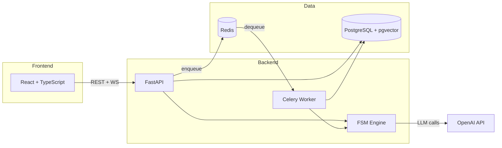

# AI Sales Agent

[](https://github.com/your-username/ai-sales-agent/actions/workflows/ci.yml)
[](LICENSE)
[](https://www.python.org/downloads/)
[](https://nodejs.org/)

AI-powered sales agent with a visual flow editor. Build, configure, and deploy conversational sales scripts — no code required.

<!-- Screenshot/GIF will be added after demo -->

## Features

- **Visual Flow Editor** — Drag-and-drop script builder with React Flow
- **FSM Engine** — Finite state machine that guides conversations through configurable steps
- **Acceptance Criteria** — AI-driven script transitions based on conversation context
- **Operator Takeover** — Jump into any conversation and take control from the AI
- **RAG Integration** — Upload documents (.docx, .pdf, .txt) as knowledge base
- **Real-time Chat** — WebSocket-powered live messaging
- **Structured Logging** — JSON logs with full conversation tracing
- **Extensible** — Abstract provider/channel layers for easy integration

## Architecture



## Tech Stack

| Layer | Technology |
|-------|-----------|
| Backend | FastAPI, SQLAlchemy (async), Pydantic v2, Celery |
| Frontend | React 18, TypeScript, Tailwind CSS, shadcn/ui, React Flow |
| Database | PostgreSQL 16 + pgvector |
| Queue | Redis 7 |
| AI | OpenAI SDK (extensible to any provider) |
| Deploy | Docker Compose |

## Quick Start

```bash
# Clone
git clone https://github.com/your-username/ai-sales-agent.git
cd ai-sales-agent

# Configure
cp backend/.env.example backend/.env
# Edit backend/.env — set your OPENAI_API_KEY

# Start all services
make dev

# Create initial user (first-time only)
make install

# Open http://localhost:3000
```

## Project Structure

```
.
├── backend/
│   ├── app/
│   │   ├── auth/          # JWT authentication
│   │   ├── flow/          # Flow/Script/Step CRUD + FSM engine
│   │   ├── chat/          # Chat, messages, WebSocket, Celery tasks
│   │   ├── ai/            # AI provider abstraction + OpenAI + XML prompts
│   │   ├── rag/           # Document upload, chunking, pgvector retrieval
│   │   ├── settings/      # Company settings, rules, restrictions
│   │   ├── analytics/     # Dashboard stats
│   │   ├── channel/       # Message channel abstraction
│   │   ├── health/        # Health check endpoint
│   │   └── common/        # ApiResponse, pagination, error handling
│   ├── alembic/           # Database migrations
│   ├── tests/             # pytest tests
│   └── Dockerfile
├── frontend/
│   ├── src/
│   │   ├── api/           # Typed API client + endpoints
│   │   ├── features/      # Dashboard, Flow Editor, Chats, Settings
│   │   └── shared/        # Layout, hooks, WebSocket client
│   └── Dockerfile
├── docker-compose.yml
├── Makefile
├── CLAUDE.md              # Full project specification
└── CONTRIBUTING.md
```

## Development

```bash
make dev          # Start all services
make test         # Run all tests
make lint         # Run linters + type checks
make lint-fix     # Auto-fix lint issues
make migrate      # Run database migrations
make install      # First-time user setup
make clean        # Stop and remove containers
make help         # Show all commands
```

## API Documentation

Interactive docs available at:
- **Swagger UI**: http://localhost:8000/docs
- **ReDoc**: http://localhost:8000/redoc

## Contributing

See [CONTRIBUTING.md](CONTRIBUTING.md) for development setup and guidelines.

## License

[MIT](LICENSE)

## Acknowledgments

Inspired by [Dialogex](https://dialogex.io) — AI-powered sales automation platform.
